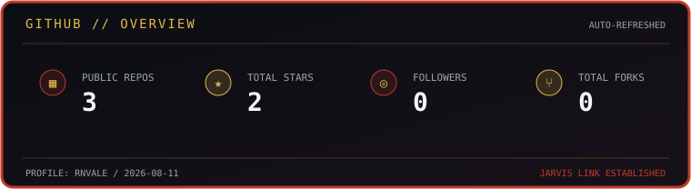
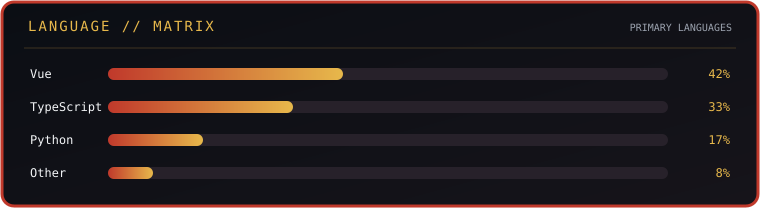

  
   
  <code>IRON MAN FLYING RENDER · CC0 1.0 · WIKIDEAS1</code>

 

  
  
<code>JARVIS ONLINE · 用数据构建体验 · BUILDING IN PUBLIC</code>

  
  
  

## CURRENT DIRECTION

用数据可视化、3D 交互和动效，把复杂信息做成更容易理解的数字体验。

目前主要使用 `Vue`、`TypeScript`、`Python`、`Three.js`，保持小步构建，持续迭代。

## ARMOR SYSTEMS

  
  
  
  
  
  

## SYSTEM TELEMETRY

  
   
  

## NAVIGATION

  <a href="https://github.com/rnvale">GitHub</a> ·
  <a href="https://haolin-zone.xyz">Live Site</a> ·
  <a href="https://github.com/rnvale/AppInsight">AppInsight</a> ·
  <a href="https://github.com/rnvale/marvel-archive-3d">Marvel Archive</a>

  <a href="https://commons.wikimedia.org/wiki/File:Iron_Man_flying_render.webp">主视觉来源</a> · CC0 1.0 · <code>JARVIS // END OF TRANSMISSION</code>

