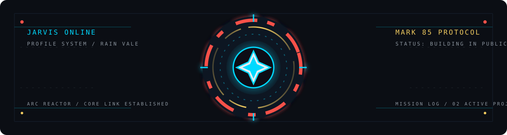

  
  <h1>Rain Vale</h1>
  
<code>JARVIS // PROFILE SYSTEM</code>

  
  

    
    
    
  

---

## MISSION LOG

我专注于把复杂数据变成可理解的产品体验，也喜欢用 3D、动效和交互把数字空间做得更有生命力。

### 01 // AppInsight

通用文本评论情感分析可视化架构。基于 Vue 3 + TypeScript 与 Flask/Pandas，提供 20+ 种交互式图表、全局筛选、主题聚类、NPS 分析和数据钻取能力。

`Vue 3` `TypeScript` `Flask` `Pandas` `ECharts` `Three.js` `GSAP`

[查看仓库](https://github.com/rnvale/AppInsight) · [在线演示](https://haolin-zone.xyz)

### 02 // Marvel Multiverse Archive

本地运行的漫威主题 3D 互动档案馆 MVP。以钢铁侠反应堆进入 Nexus 中枢，串联作品展厅、英雄档案和时间观测站。

`TypeScript` `React Three Fiber` `Three.js` `Vite` `Vitest`

[查看仓库](https://github.com/rnvale/marvel-archive-3d)

---

## ARMOR SYSTEMS

  
  
  
  
  
  
  
  

`FRONTEND` Vue 3 · TypeScript · Vite · Element Plus

`BACKEND & DATA` Flask · Pandas · NumPy · REST APIs

`3D & MOTION` Three.js · React Three Fiber · GSAP · ECharts

`DELIVERY` Vercel · Render · GitHub

---

## SYSTEM TELEMETRY

  
  

---

## NAVIGATION

[GitHub](https://github.com/rnvale) · [Live Site](https://haolin-zone.xyz) · [AppInsight](https://github.com/rnvale/AppInsight) · [Marvel Archive](https://github.com/rnvale/marvel-archive-3d)

  <code>JARVIS // END OF TRANSMISSION</code>

